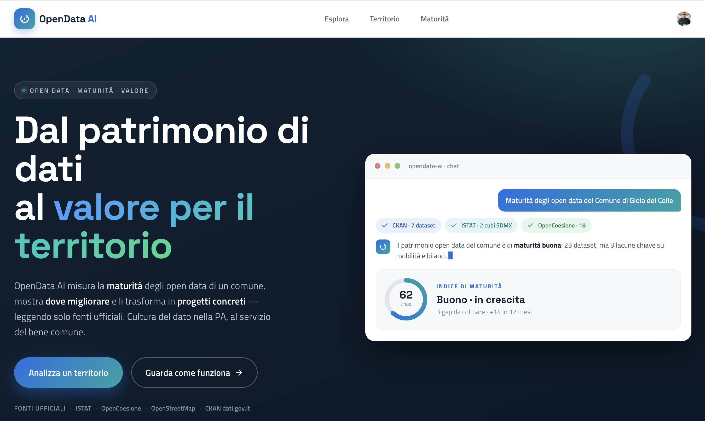
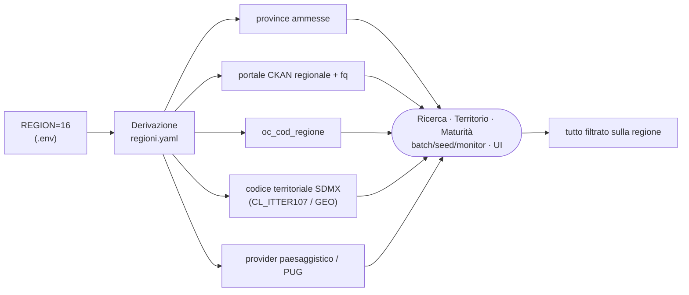
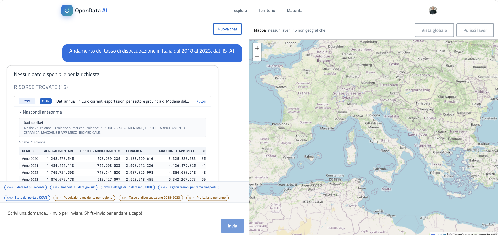
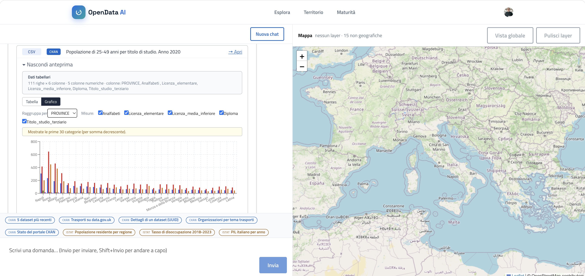
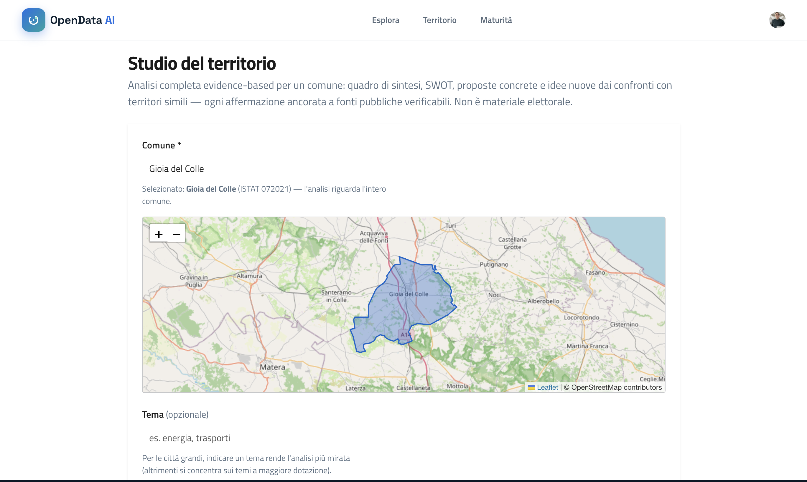
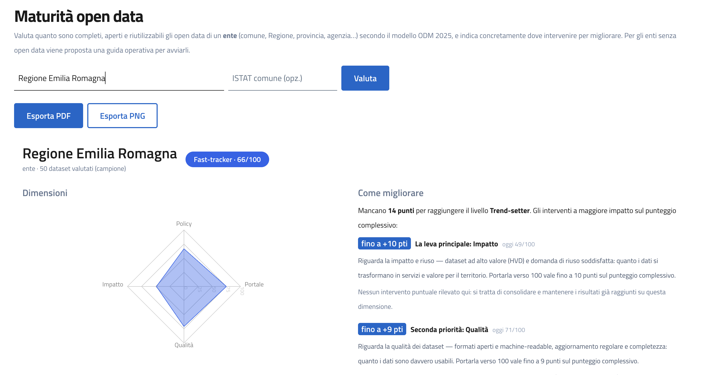
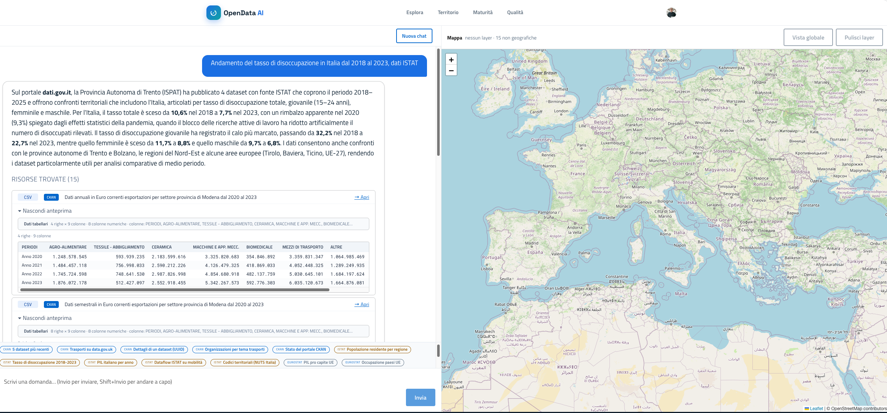
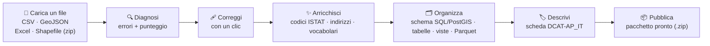
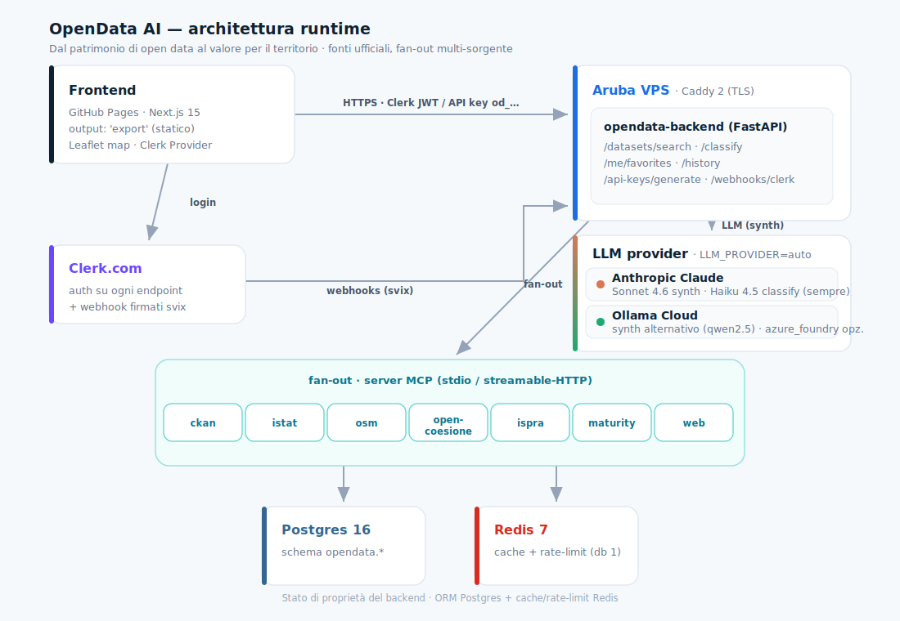

# opendata-ai

[](https://www.buymeacoffee.com/f9t3zol)



Conversational + map-based access to **Italian and European open data
portals** through a single AI-powered backend. The user asks for
"electric-vehicle charging stations in Lombardy" and the platform fans the
query out across CKAN portals (`dati.gov.it`, regional / municipal CKAN
instances) and statistical providers (ISTAT, Eurostat, OECD via SDMX 2.1),
synthesises one answer, renders any geographic resources on a Leaflet+OSM
map, and optionally classifies the dataset against a caller-supplied
taxonomy with Claude Haiku.

> Static frontend on GitHub Pages, FastAPI backend on a self-hosted Aruba
> VPS, Clerk-authenticated everywhere except `/health`.

## Capability layer (valorizzazione + maturità)

Sopra l'accesso ai dati, la piattaforma offre un **capability layer** (Fasi 0–5):
maturità open-data degli enti (ODM 2025), valore del dato (art. 14 Dir. UE
2019/1024), modalità Territorio (profilo + investimenti OpenCoesione), use case
applicativi (ApriQui AI, PugliaTrip Brain), **sito civico** statico esportabile con
accountability di community, un **anello valore⇄maturità** (i gap di dato
penalizzano l'Impact dell'ente) e un **agente di monitoraggio schedulato**
(cron) che controlla in automatico freshness/qualità/link dei dataset e
notifica via webhook o email quando qualcosa cambia o si rompe. Diagramma e
flussi: **`docs/architettura.md`**; modello dati: **`docs/data-model.md`**.
Pilota: Comune di Gioia del Colle.

## Le quattro modalità: Esplora · Territorio · Maturità · Qualità

La navbar dell'applicazione corrisponde a tre modalità d'uso, costruite l'una
sull'altra: si **esplora** il dato grezzo, lo si trasforma in uno **studio del
territorio** azionabile, e si misura quanto bene un ente **pubblica e mantiene**
quel dato. Esplora è l'accesso conversazionale alle fonti; Territorio e Maturità
sono le due lenti del *capability layer* che danno valore e accountability al
patrimonio informativo.

#### Scoping mono-regione (`REGION`)

**Cos'è.** Una sola variabile nel `.env` — `REGION` (codice ISTAT regione a 2
cifre, es. `16` = Puglia) — rende `opendata-ai` il **cruscotto degli open data di
una singola regione**: ricerca, studio del territorio, maturità e analisi si
riferiscono tutti a quella regione.

**Come funziona.** `REGION` è la **sorgente di verità**: da essa si derivano —
senza valori cablati nel codice — le province ammesse, il portale CKAN regionale,
il codice OpenCoesione e i filtri di ricerca (`config_data/regioni.yaml`). La
ricerca CKAN parte dal portale regionale (non da `dati.gov.it`) e le query SDMX
(ISTAT/Eurostat/OECD) sono pre-filtrate sulla dimensione territoriale; gli
endpoint di territorio/maturità **rifiutano i comuni fuori regione**; i motori
paesaggistico/PUG e i job batch/seed/monitor seguono la stessa regione. La UI
mostra un badge **«Regione: …»** e l'autocomplete propone solo i comuni ammessi.

**A cosa serve.** Un deployment per ente/regione, senza fork: chi lo installa
vede solo il proprio territorio. Lasciando `REGION` vuoto (dev) non c'è alcun
limite — comportamento nazionale/internazionale invariato (retro-compatibile col
vecchio `TERRITORIO_PROVINCE`).



---

### 1. Esplora — esplorazione conversazionale dei dati



**Cos'è.** Una chat che traduce una domanda in linguaggio naturale (es.
*"piste ciclabili a Bologna"*, *"tasso di disoccupazione 2018–2023"*) in
interrogazioni concrete sui portali open data, e restituisce sia una sintesi
testuale sia le **risorse effettivamente trovate**, ciascuna con un'anteprima
navigabile.

**Come funziona.** La domanda viene fatta **fan-out** in parallelo su più fonti
— portali **CKAN** (`dati.gov.it`, regionali/comunali, e portali esteri) e
provider statistici **SDMX** (ISTAT, opzionalmente Eurostat/OECD). Le risposte
parziali e la sintesi finale arrivano **in streaming**. La sintesi è protetta da
*guardrail anti-allucinazione*: niente segnaposto inventati, e gli URL delle
risorse vengono verificati invece di essere fabbricati, con una rete di sicurezza
deterministica che fa sempre emergere i dati pubblici realmente esistenti. Ogni
risorsa può inoltre riportare una **value card** (valore del dato secondo
l'art. 14 della Dir. UE 2019/1024).

La stessa risorsa si visualizza in tre modi, a seconda del contenuto:

- **Tabella** — dati tabellari (CSV/JSON da CKAN, osservazioni SDMX-CSV da
  ISTAT/Eurostat/OECD) con righe, colonne e tipi rilevati automaticamente. Sopra
  l'anteprima compaiono numero di righe/colonne e quali colonne sono numeriche.

  

- **Grafico** — le colonne numeriche diventano serie selezionabili, raggruppate
  per una dimensione a scelta (es. *PROVINCE*); per i dataset grandi mostra le
  prime 30 categorie per somma decrescente. Utile per leggere subito un trend o
  un confronto senza scaricare il file.
- **Mappa** — le risorse geografiche (**GeoJSON, KML, SHP, ZIP**) vengono rese
  come **layer distinti** su una mappa Leaflet+OSM, attivabili/disattivabili dal
  selettore in alto a destra; le risorse non geografiche restano disponibili come
  tabella/grafico.

  

**A cosa serve / per chi.** È il punto d'ingresso per chiunque debba *trovare e
capire* un dato senza conoscere API, formati o portali: giornalisti e data
analyst che cercano una fonte ufficiale citabile, sviluppatori che vogliono
individuare in fretta il dataset giusto da integrare, funzionari e cittadini che
vogliono una risposta documentata. Sostituisce ore di ricerca manuale su decine
di cataloghi eterogenei con un'unica domanda.

**Da dove partire.** Query di esempio copia-e-incolla (CKAN, ISTAT, risorse
mappa e tabellari) in **[`docs/EXAMPLES.md`](docs/EXAMPLES.md)**.

---

### 2. Territorio — studio evidence-based di un comune



**Cos'è.** Un'**analisi completa di un comune** generata a partire dai soli dati
pubblici. Si seleziona il comune (risolto via ISTAT — es. *Gioia del Colle,
ISTAT 072021* — con il confine amministrativo mostrato sulla mappa) e,
opzionalmente, un **tema** (es. energia, trasporti) che mira l'analisi nelle
città grandi; senza tema l'analisi si concentra sugli ambiti a maggiore dotazione
di dati.

**Cosa produce.** Un report strutturato e azionabile: **quadro di sintesi**,
analisi **SWOT**, **proposte concrete**, e **idee nuove** ricavate dal
**confronto con territori simili**. L'analisi tematica passa per **dieci lenti**
dedicate — *Commercio, Turismo, Lavoro, Trasporti, Welfare, Istruzione, Casa/
Abitazioni, Reddito, Ambiente, Sanità* — ciascuna ancorata a fonti specifiche
(es. ISTAT ASIA per il commercio, indicatori di inclusione e **investimenti
OpenCoesione** per il welfare, condizioni abitative ISTAT 8milaCensus per la
casa, dichiarazioni IRPEF del MEF per il reddito). Le zone interne sono
individuate via tag OpenStreetMap.

**Affidabilità e accountability.** Ogni affermazione è **evidence-based**,
ancorata a fonti pubbliche verificabili — *non è materiale elettorale*. Sotto la
soglia minima di dati l'analisi dichiara *"dato insufficiente"* invece di
produrre numeri fuorvianti, e tutto ciò che usa fonti live è **fail-safe**. I
report sono **versionati** (snapshot non sovrascritti, con diff tra versioni) ed
esportabili come **sito civico** statico e autoconsistente, con accountability di
**community** (check-in). Un avviso segnala che i dati pubblici possono essere
**disallineati** per ritardi burocratici. Vale infine l'**anello
valore⇄maturità**: i gap di dato emersi dai report penalizzano la dimensione
*Impatto* dell'ente e si traducono in "domanda di riuso non soddisfatta".

**Riconciliazione del suolo.** Per i vuoti urbani e le aree dismesse individuate
via OpenStreetMap, il report confronta il *tag* OSM con lo **stato reale del
suolo** ricostruito dalle fonti pubbliche oggi disponibili (vincolo idrogeologico
IdroGEO PAI a scala comunale, **copertura del suolo** puntuale da Corine Land Cover
ISPRA per capire se un'area è già *impermeabilizzata/edificata*, **vincoli
paesaggistici** dal piano regionale — PPTR, oggi Puglia — **siti contaminati e
bonifiche** SIN-SIR dal catasto MOSAICO di ISPRA, **destinazione urbanistica** dalla
zonizzazione PUG/PRG quando il comune la pubblica come open data, progetti
OpenCoesione nel comune) e propone una **classificazione** (dismesso, **brownfield**
se contaminato, vincolato, **frangia** urbana, libero…) con **causa di abbandono** e
**azione consigliata**. Per le aree produttive e a verde il report applica i **pattern
di rigenerazione**: *zone industriali* → «riuso prima di espansione» + dotazione verde
≥10% in zona D (strumenti PIP/ASI/APEA); *parchi* → 9 mq/ab fruibili entro ~300 m.
Coerente col principio del progetto — *la fonte ufficiale è
il dato aperto, non un documento caricato* — quando un comune **non** pubblica il PUG
come dato aperto l'analisi non lo inventa: lo segnala come **dato da aprire**
(raccomandazione DCAT-AP_IT) e come domanda di riuso non soddisfatta nella maturità
dell'ente. L'incertezza è
esplicita, non nascosta: ogni poligono ha una **confidenza** (Alta solo se ≥2 fonti
concordano, Bassa se l'unica evidenza è il tag OSM) e i campi non ancora
verificabili con le fonti correnti (catasto, destinazione PUG) restano *"da
verificare"*. Un controllo di qualità **avvisa**
(senza mai bloccare il report) quando lo stato del suolo non è verificabile —
coerente col principio: ogni fonte mancante **degrada la confidenza, non blocca**.
Nel report la sezione **"Stato reale del suolo"** mostra ogni area con un **badge di
confidenza** (Alta/Media/Bassa) e i campi *"da verificare"* resi espliciti; la
**proprietà** non è mai presentata come pubblica per default. La sezione è inclusa
anche nell'**export PDF** e nel **sito civico** (pagina "Stato del suolo").

**Export.** Ogni analisi generata può essere esportata in tre formati: **PDF**
(documento da condividere o stampare), **Markdown** (testo riusabile in altri
strumenti) e **sito** (sito civico statico e autoconsistente). L'export riporta
il comune (ISTAT) e la data/ora di generazione, così la versione resta tracciabile.


**A cosa serve / per chi.** Trasforma il patrimonio open data in materiale
decisionale: amministratori e uffici tecnici che pianificano interventi,
associazioni e comitati che vogliono un quadro neutro e citabile, giornalisti che
documentano un territorio, consulenti e ricercatori che confrontano comuni
simili. È il ponte tra "il dato esiste" e "il dato serve a decidere".

---

### 3. Maturità — scorecard open data dell'ente (ODM 2025)



**Cos'è.** Una **scorecard 0–100** che misura quanto bene un ente *pubblica e
mantiene* i propri dati aperti, secondo il modello **Open Data Maturity (ODM)
2025**.

**Cosa misura.** Il punteggio si compone su quattro dimensioni — **Policy,
Portale, Qualità, Impatto** — alimentate da standard riconosciuti (modello
**5-star** di Berners-Lee, principi **FAIR**, **DCAT-AP_IT**, **ISO 25012**,
**High-Value Datasets**). All'ente è assegnato un **livello** (Beginner →
Follower → Fast-tracker → Trend-setter) ed è mostrato un **radar** delle quattro
dimensioni con le **leve di miglioramento** ordinate per impatto sul punteggio —
così l'ente sa *cosa cambiare per primo* per salire di livello. Sotto la soglia
minima di dati dichiara *"dato insufficiente"* invece di assegnare punteggi
fuorvianti. La scorecard è **esportabile** (CSV, e PNG/PDF della scheda).

**A cosa serve / per chi.** È lo strumento del **Responsabile per la Transizione
Digitale (RTD)** e dell'open data manager: dà una fotografia oggettiva e
comparabile dello stato di pubblicazione, evidenzia le priorità d'azione, e
permette **benchmarking** tra enti — e, quando ci sono almeno due misurazioni
salvate, anche un piccolo **grafico dell'andamento nel tempo** (il punteggio
sale o scende? di quanto?). Per chi riusa i dati è un segnale di affidabilità
della fonte; per chi li pubblica, una roadmap concreta di miglioramento.

**Provalo subito.** Vai su `/maturita`, digita il nome di un ente (es. *"Regione
Puglia"* o *"Comune di Bari"*) e premi **Valuta**. La prima volta ottieni la
scorecard con radar e leve di miglioramento; se rivaluti lo **stesso ente** in
un momento successivo (giorni o settimane dopo), dalla seconda valutazione in
poi compare anche la sezione **"Andamento nel tempo"** con il grafico del
punteggio.

---

### 4. Qualità — come si misura la qualità di un dataset



**Cos'è.** Il **Data Quality Lab**: porti un file di dati (o apri una risorsa
trovata in Esplora) e ottieni una **diagnosi automatica** della sua qualità, la
versione già sistemata da scaricare, i suggerimenti per arricchirlo e la scheda
descrittiva pronta da pubblicare — passo per passo, senza dover essere un
esperto di database:



**Come si misura.** La qualità non è un'opinione: parte dal **profilo automatico**
del dato — già visibile nell'anteprima di ogni risorsa, che rileva *righe,
colonne, colonne numeriche e tipo dei campi* — e la confronta con standard
riconosciuti: principi **FAIR** (trovabile, accessibile, interoperabile,
riusabile), modello **5-star** di Berners-Lee, **ISO 25012** (accuratezza,
completezza, coerenza, attualità) e **DCAT-AP_IT** per i metadati. Su questa base
il Lab segnala gli **errori più comuni** (celle vuote, date in formati diversi,
codifiche/accenti sbagliati, doppioni), calcola un punteggio *prima/dopo* e
propone le **correzioni** applicabili con un clic. Quando il dato è sotto la
soglia minima per un giudizio attendibile dichiara *"dato insufficiente"* invece
di assegnare punteggi fuorvianti.

**Oltre la diagnosi: arricchire e organizzare.** Una volta pulito, il Lab
suggerisce come renderlo più utile:
- **Arricchimento** — se ci sono nomi di comuni senza codice ISTAT, indirizzi
  senza coordinate, o colonne con poche parole ripetute ma scritte in modo
  incoerente, propone rispettivamente un *join* con l'anagrafica ISTAT, una
  *geocodifica* (indirizzo → coordinate) e un *vocabolario controllato*.
- **Da dato a schema** — genera il comando pronto (`CREATE TABLE`) per caricare
  il dato in un database: tipi di colonna, chiave primaria, indici. Per i dati
  geografici (GeoJSON), lo stesso ma per **PostGIS**/**GeoPackage**.
- **Normalizzazione** — le colonne ripetute (es. una "zona" con pochi valori
  ripetuti mille volte) diventano **tabelle di lookup** vere e proprie, più
  **viste** già pronte per i riepiloghi più richiesti (totali per categoria,
  andamento nel tempo, incroci tra le due).
- **Schede standard** — genera la scheda descrittiva in due vocabolari: **DCAT-AP_IT**
  (il catalogo nazionale) e **schema.org/Dataset** (quello letto da *Google
  Dataset Search*), entrambe validabili con lo stesso controllo FAIR + licenza.
- **I dati che contano di più (HVD)** — stima se il file rientra in una delle 6
  categorie di **High-Value Dataset** della normativa UE (Reg. 2023/138):
  geospaziale, ambiente, meteo, statistici, imprese, mobilità. È un'euristica sui
  nomi di colonna, sul titolo e sul nome del file: ogni stima dichiara la propria
  **confidenza** (alta/media/bassa) e gli indizi che l'hanno prodotta — mai un
  verdetto secco. La stima compare anche nella scheda DCAT/schema.org, nella
  validazione e nel README del pacchetto di pubblicazione, perché per gli HVD
  valgono obblighi specifici (licenza aperta, formato machine-readable, API).
- **Convertitori avanzati** — non serve partire da un CSV: un file **Excel
  (XLSX/XLS)** viene convertito in CSV direttamente nel browser (con scelta del
  foglio), e uno **Shapefile zippato** diventa un GeoJSON già riproiettato in
  WGS84, pronto per la mappa. In uscita, oltre al CSV corretto, si può scaricare
  la versione **Parquet** (colonnare e compressa, con i tipi inferiti dal
  contenuto): il consiglio "usa un formato colonnare" della sezione scala,
  applicato con un clic.

**A cosa serve / per chi.** È lo strumento di chi *pubblica* — uffici dati,
RTD, open data manager — per alzare la qualità prima della pubblicazione e
rispettare gli standard europei; e di chi *riusa*, per capire in fretta se un
dataset è davvero pronto all'uso, come arricchirlo e come portarlo in un
database. Si integra con la **Maturità**: i problemi di qualità trovati qui
sono le leve concrete che fanno salire la dimensione Qualità della scorecard
dell'ente.

**Provalo subito.** Vai su `/qualita`, incolla uno di questi esempi e premi
**Analizza**:

Tabellare (CSV) — mostra diagnosi, **arricchimento** e **normalizzazione**:
```csv
comune,zona,indirizzo,anno
Gioia del Colle,Nord,Via Roma 1,2023
Bari,Sud,Via Garibaldi 5,2023
Modugno,Nord,Via Dante 12,2024
Bari,Sud,Via Cavour 3,2024
```
Poi apri **"Suggerimenti di arricchimento"** (join ISTAT per `comune`,
geocodifica per `indirizzo`) e **"Normalizzazione & modello"** (tabella di
lookup per `zona` + viste di totali/andamento/pivot).

Geografico (GeoJSON) — mostra diagnosi e **schema PostGIS/GeoPackage**:
```json
{"type":"FeatureCollection","features":[{"type":"Feature","geometry":{"type":"Point","coordinates":[16.92,40.79]},"properties":{"nome":"Gioia del Colle","popolazione":27889}}]}
```
Poi apri **"Schema geografico (PostGIS / GeoPackage)"** per il `CREATE TABLE`
con colonna `geom` + indice spaziale, e il comando `ogr2ogr`.

Con il CSV di sopra, compila anche titolo/descrizione/licenza/ente nella
scheda descrittiva e genera **sia** "Scheda DCAT-AP_IT" **che** "Scheda
schema.org (Dataset)": stessi dati del file, due vocabolari, ciascuno
validabile con il proprio punteggio FAIR.

## Monitoraggio automatico — i controlli girano da soli

**Cos'è.** Un agente schedulato (cron) che ripete in automatico, per una lista
di risorse configurate, gli stessi controlli della Qualità: la risorsa è
ancora **raggiungibile** (non è sparita o rotta)? è **aggiornata** entro la
cadenza dichiarata (mensile, annuale, …) o è diventata stantia? il punteggio
di qualità è **peggiorato** rispetto all'ultima volta? Quando succede qualcosa
di nuovo — non ogni volta, solo quando cambia — **notifica** su un webhook o
via email (entrambi opzionali, configurati per singola risorsa).

**Avvisi di maturità nel tempo.** Oltre alle singole risorse, l'agente può
osservare l'intera **scorecard di maturità** di un ente: quando una nuova
valutazione risulta peggiore della precedente — calo del punteggio, retrocessione
di livello (es. da Fast-tracker a Follower), o un ente che scivola in "dato
insufficiente" — parte lo stesso avviso, una sola volta per regressione. Si
attiva con `opendata-monitor --add-maturity-watch <entity_id>` (più webhook/email
opzionali); l'esito compare anche nella sezione "Monitoraggio automatico" della
pagina Maturità, accanto all'andamento nel tempo.

**Come si usa.** Console-script `opendata-monitor` (stesso schema di
`opendata-batch`): lanciato da cron, legge le risorse da controllare dalla
tabella `opendata.monitor_targets`, salva ogni controllo come snapshot in
`opendata.monitor_runs` (storicizzato, mai sovrascritto) e confronta con
l'ultimo per capire cosa è nuovo. Lo stato più recente è consultabile anche
via `GET /monitor/{entity_id}`.

**A cosa serve / per chi.** È il "non devo controllare io ogni giorno" per
chi pubblica: un ente collega le proprie risorse una volta e riceve un avviso
solo quando serve davvero — un link rotto, un dataset che non si aggiorna più,
un formato che si è rotto, una pagella di maturità in calo.

## Supported open data sources

- **CKAN** (any portal) — `ckan-mcp-server` (11 tools)
  - Endpoint: `<portal>/api/3/action/*`
  - Fetch: datasets, resources, file content (CSV/JSON/GeoJSON/TXT)
- **ISTAT** — `istat-mcp-server` (9 tools, agency `IT1`)
  - Endpoint: `esploradati.istat.it/SDMXWS/rest`
  - Fetch: dataflows, DSDs, codelists, observations (SDMX-CSV)
- **Eurostat** *(opt-in)* — `istat-mcp-server` (agency `ESTAT`)
  - Endpoint: `ec.europa.eu/eurostat/api/dissemination/sdmx/2.1`
  - Fetch: same as ISTAT (SDMX 2.1)
- **OECD** *(opt-in)* — `istat-mcp-server` (agency `all`)
  - Endpoint: `sdmx.oecd.org/public/rest`
  - Fetch: same as ISTAT (SDMX 2.1)
- **Socrata** *(opt-in — `ENABLE_SOCRATA`)* — `socrata-mcp-server`
  - Endpoint: any Socrata portal via `base_url` (SODA / Discovery API, SoQL)
  - Fetch: dataset catalog + records — joins the search fan-out when enabled
- **OpenStreetMap** *(render-only)* — `osm-mcp`
  - Endpoint: `nominatim` / `overpass` / `osrm`
  - Fetch: renders GeoJSON layers into Leaflet HTML
- **OpenPNRR** *(openpolis — NRRP/PNRR open data)* — `openpnrr-mcp-server`
  - Endpoint: `openpnrr.it/api/v1` (no auth, licence **ODbL 1.0**)
  - Fetch: missions/components/measures/deadlines, territories, funded
    projects + payments (programmed-vs-paid on the PNRR stream; standalone,
    not part of the dataset fan-out)
- **Centri d'Italia** *(openpolis — migrant-reception open data)* — `centriditalia-mcp-server`
  - Source: bulk CSV on S3 (licence **CC-BY 4.0**) → local SQLite mirror
  - Fetch: CAS/CPA/hotspot centres + SAI projects/structures (capacity,
    presences, daily cost per guest) by ISTAT territory — aggregated per
    centre, standalone, not part of the dataset fan-out)

Default portals for CKAN: the agent picks from an embedded list (`dati.gov.it`,
`data.gov.uk`, `data.gov`, `open.canada.ca`, `data.gov.au`, …). Override per
call via `base_url` in the chat payload or via `CKAN_DEFAULT_BASE_URL` env.
Any CKAN portal works this way, including `dati.anticorruzione.it/opendata`
(ANAC public-procurement catalog, #99) — dataset discovery only: its resources
are bulk monthly/annual dumps (no CKAN DataStore), so per-CIG/per-authority
row lookups aren't possible without PDND-gated institutional access.

**Catasto / quotazioni immobiliari OMI (#147)** — no dedicated connector: the
aggregated cadastral / real-estate-market (OMI, *Osservatorio del Mercato
Immobiliare*) data that is genuinely open is **already reachable via the generic
`ckan-mcp-server`**. A search for *"quotazioni immobiliari OMI"* on `dati.gov.it`
returns 130+ datasets from municipal/regional portals (Milano, Toscana,
Piemonte, …) with clean CSV/JSON resources the CKAN agent already fetches. The
*national* Agenzia delle Entrate OMI source is **not** an open REST API — its
bulk "servizio di download" is gated behind a per-download licence acceptance
(session-based), so a dedicated scraper would be fragile and outside the
"solo open data pubblici · fail-safe" principle. Point the CKAN agent at the
relevant portal (`base_url`) instead. The Italian cadastre proper (per-parcel
visure) is a paid Agenzia delle Entrate service, out of scope for open data.

## MCP servers

Ogni fonte è un server **MCP** componibile (stdio o streamable-HTTP su `/mcp`),
usabile dal backend e da qualsiasi client MCP (Claude Desktop, Cursor, …). README
dedicato per ciascuno:

| Server | Cosa espone | README |
|---|---|---|
| **ckan-mcp-server** | Action API CKAN, `base_url` per-portale | [`ckan-mcp-server/README.md`](ckan-mcp-server/README.md) |
| **istat-mcp-server** | SDMX 2.1 — ISTAT · Eurostat · OECD | [`istat-mcp-server/README.md`](istat-mcp-server/README.md) |
| **osm-mcp** | Geocoding, POI, routing, zone + mappe Leaflet | [`osm-mcp/README.md`](osm-mcp/README.md) |
| **opencoesione-mcp-server** | Progetti coesione: finanziato vs speso | [`opencoesione-mcp-server/README.md`](opencoesione-mcp-server/README.md) |
| **openpnrr-mcp-server** | PNRR (openpolis): missioni/misure/scadenze, progetti finanziati vs pagati — licenza ODbL (standalone, non nel fan-out) | [`openpnrr-mcp-server/README.md`](openpnrr-mcp-server/README.md) |
| **centriditalia-mcp-server** | Accoglienza migranti (openpolis): centri CAS/CPA/hotspot + SAI, capienza/presenze/costo per territorio — CSV bulk→mirror SQLite, licenza CC-BY (standalone, non nel fan-out) | [`centriditalia-mcp-server/README.md`](centriditalia-mcp-server/README.md) |
| **ispra-mcp-server** | Rischio idrogeologico per comune (IdroGEO) | [`ispra-mcp-server/README.md`](ispra-mcp-server/README.md) |
| **ods-mcp-server** | OpenDataSoft Explore API v2.1, `base_url` per-portale | [`ods-mcp-server/README.md`](ods-mcp-server/README.md) |
| **socrata-mcp-server** | Socrata Discovery/Views/SODA API, `base_url` per-portale — nel fan-out di ricerca (opt-in `ENABLE_SOCRATA`) | [`socrata-mcp-server/README.md`](socrata-mcp-server/README.md) |
| **bdap-mcp-server** | Bilanci comunali SIOPE (entrate/spese per titolo) via BDAP, query OData mirata (standalone, non ancora nel fan-out) | [`bdap-mcp-server/README.md`](bdap-mcp-server/README.md) |
| **maturity-mcp-server** | Scorecard maturità open data (ODM 2025) | [`maturity-mcp-server/README.md`](maturity-mcp-server/README.md) |
| **web-mcp** | Web search/fetch via SearXNG self-hosted | [`web-mcp/README.md`](web-mcp/README.md) |
| **opendata-mcp-server** *(prodotto)* | Le 4 modalità — Esplora/Territorio/Maturità/Qualità (+classify) — come tool MCP per client esterni (OpenClaw, Claude Desktop): proxy sottile verso il backend | [`opendata-mcp-server/README.md`](opendata-mcp-server/README.md) |

Gli 8+ server qui sopra espongono le **fonti dati** al LLM del backend. Il
**`opendata-mcp-server`** è diverso: espone le **funzioni di prodotto** (le 4
modalità) come tool MCP a un client/harness esterno, facendo da proxy sugli
endpoint REST del backend (invariante R13 — complementare all'A2A, che espone
l'intero agente). Snippet di configurazione per OpenClaw / Claude Desktop nel
suo README.

## Infrastructure

<p align="center">
  
</p>

| Component | Stack |
|---|---|
| Frontend | Next.js 15 (`output: 'export'`) → GitHub Pages, Leaflet map (KML/GeoJSON/GPX/SHP/WMS/ZIP/KMZ), Clerk `<ClerkProvider>` + `clerkMiddleware` |
| Auth | **Clerk** on every endpoint except `/health`; svix-signed webhook on `/webhooks/clerk` |
| Backend | FastAPI on Aruba VPS, dockerised, exposed at `https://api.opendata.<domain>` via Caddy + Let's Encrypt |
| MCP servers | `ckan-mcp-server`, `istat-mcp-server`, `osm-mcp` — same image speaks **stdio** (Claude Desktop) or **streamable-HTTP** (backend) |
| Database | **Neon** serverless Postgres, schema `opendata.*` (users / favorites / history / api_keys / classifications). Migrations owned by [agent-stack](vendor/agent-stack); local stub in `opendata-backend/migrations/` |
| Cache | Redis 7 logical db 1 — `od:fetch:*` 6h, `od:classify:*` 24h, `od:by-category:*` 5min, `od:ratelimit:*` 60s window |
| AI | Anthropic Claude. **Sonnet 4.6** for the synth aggregator; **Haiku 4.5** for the classify endpoint — cheaper task, smaller model |
| CI/CD | GitHub Actions — `ci.yml` (ruff + pytest + buildx), `docker-publish.yml` (multi-arch GHCR), `deploy-pages.yml` (frontend), `deploy-aruba.yml` (backend, tag-driven SSH) |

## Repository layout

| Path | Role |
|---|---|
| `opendata_core/` | Shared async clients (CKAN, SDMX, OSM render + Nominatim/Overpass/OSRM). Consumed by both the MCP wrappers and the backend |
| `ckan-mcp-server/` | FastMCP wrapper exposing 11 CKAN Action API tools |
| `istat-mcp-server/` | FastMCP wrapper for SDMX 2.1 — works for ISTAT/Eurostat/OECD via the `agency` arg |
| `ods-mcp-server/` | FastMCP wrapper for the OpenDataSoft Explore API v2.1 (`base_url` per-portal) |
| `socrata-mcp-server/` | FastMCP wrapper for Socrata's Discovery/Views/SODA APIs (`base_url` per-portal, standalone) |
| `bdap-mcp-server/` | FastMCP wrapper for BDAP/SIOPE municipal budgets (revenue/expense per titolo, OData-queried, standalone) |
| `osm-mcp/` | FastMCP wrapper that renders GeoJSON into self-contained Leaflet+OSM HTML |
| `opendata-backend/` | FastAPI app — routers (`datasets/me/api_keys/webhooks`), Clerk auth, Postgres ORM, Redis cache + rate limit, Claude classify |
| `opendata-ai-ui/` | Next.js 15 static-export frontend (Clerk + Leaflet) |
| `infra/aruba/` | Production compose + Caddyfile + bootstrap guide for the Aruba VPS |
| `infra/ollama/` | Optional baked Ollama image for local debug (qwen2.5:32k) |
| `vendor/agent-stack/` | Submodule with the canonical `opendata.*` Postgres migrations |
| `docs/claude-desktop.md` | How to plug the 3 MCP servers into Claude Desktop |
| `.clerk/config.md` | Clerk CLI setup recipe — pinned to app `app_3EMALiLi0UTULl89JPMKtaLENoy` |

## Endpoints

All endpoints (except `/health`) require authentication. Two credentials are
accepted interchangeably:

- **Clerk session JWT** — `Authorization: Bearer <jwt>`, used by the web UI.
- **API key** — `Authorization: Bearer od_…` or `X-API-Key: od_…`, for
  headless clients, scripts and agent integrations (see
  [Authentication & API keys](#authentication--api-keys)).

The same rule guards the A2A JSON-RPC endpoint (`/a2a/`); only the AgentCard
discovery (`/.well-known/agent-card.json`) is public. Six skills are published
(selected via `message.metadata.skill`): `search_open_data`, `find_geo_resources`,
`classify_dataset`, `assess_maturity`, `analyze_territory` and `data_quality`
(the Data Quality Lab — diagnosi, fix, arricchimento, stima HVD, schema,
normalizzazione, schema geografico, riepiloghi, scala, conversione GeoJSON,
export Parquet, validazione DCAT-AP_IT/schema.org + FAIR e pacchetto di
pubblicazione).

| Method | Path | Description |
|---|---|---|
| GET | `/health` | **Public** — used by health checks |
| POST | `/chat` | Back-compat alias of `/datasets/search` |
| POST | `/datasets/search` | Multi-source fan-out (CKAN + ISTAT [+ Eurostat + OECD]) |
| POST | `/datasets/by-category` | Same fan-out, scoped to a category. 5-min Redis cache |
| POST | `/datasets/fetch` | Direct resource download via shared CkanClient. 6h Redis cache |
| POST | `/datasets/classify` | Score a dataset against a taxonomy with Claude Haiku 4.5. 24h cache, durable on Postgres |
| GET / POST / DELETE | `/me/favorites[/{src}/{id}]` | Per-user dataset bookmarks |
| GET | `/me/history` | Search history per user |
| POST | `/api-keys/generate` | Create a programmatic API key — token returned once, persisted as SHA-256 |
| GET | `/api-keys` | List your keys (metadata only: name, created/last-used/revoked) |
| DELETE | `/api-keys/{id}` | Revoke one of your keys (soft-delete; 204 on success) |
| POST | `/webhooks/clerk` | svix-signed; upserts `opendata.users` on `user.{created,updated,deleted}` |
| POST | `/a2a/` | A2A JSON-RPC (authenticated). AgentCard at `/.well-known/agent-card.json` is public |

### `POST /datasets/search` — example

```bash
TOKEN=$(curl ... obtained from clerk)

curl -X POST https://api.opendata.example.com/datasets/search \
  -H "Authorization: Bearer $TOKEN" \
  -H "Content-Type: application/json" \
  -d '{"query":"Stazioni di ricarica auto elettriche a Milano"}'
```

Response:
```json
{
  "text": "Ho trovato il dataset 'Stazioni di ricarica…'",
  "resources": [
    {
      "name": "stazioni_ricarica.csv",
      "url": "https://dati.comune.milano.it/.../stazioni_ricarica.csv",
      "format": "CSV",
      "source": "ckan",
      "content": "id,lat,lon,tipo_presa\n1,45.46,9.19,CCS\n…",
      "preview_html": "<html>…Leaflet map…</html>"
    }
  ]
}
```

### `POST /datasets/classify`

```bash
curl -X POST https://api.opendata.example.com/datasets/classify \
  -H "Authorization: Bearer $TOKEN" \
  -H "Content-Type: application/json" \
  -d '{
    "source":"ckan",
    "dataset_id":"stazioni-ricarica",
    "dataset_name":"Stazioni di ricarica auto elettriche",
    "dataset_description":"Mappa delle colonnine pubbliche…",
    "taxonomy":["energy","transport","environment"]
  }'
# { "source":"ckan", "dataset_id":"stazioni-ricarica",
#   "scores":{"energy":0.78,"transport":0.94,"environment":0.41},
#   "model":"claude-haiku-4-5-20251001", "cached":false }
```

### Authentication & API keys

For programmatic access (no browser / Clerk session) use an **API key**. Mint
one from an authenticated session, then send it as a Bearer token (keys are
prefixed `od_` so the backend tells them apart from Clerk JWTs) or via the
`X-API-Key` header. The clear-text token is shown **once** — only its SHA-256
hash is stored.

```bash
# 1. Create a key (from a Clerk-authenticated session)
curl -sX POST https://api.opendata.example.com/api-keys/generate \
  -H "Authorization: Bearer $CLERK_JWT" \
  -H "Content-Type: application/json" \
  -d '{"name":"my-cli"}'
# → { "id":42, "name":"my-cli", "token":"od_…", "created_at":"…" }

# 2. Use it on any endpoint (REST or A2A)
export OPENDATA_API_KEY="od_…"
curl -s https://api.opendata.example.com/datasets/search \
  -H "X-API-Key: $OPENDATA_API_KEY" \
  -G --data-urlencode 'q=qualità aria a Milano'

# 3. List / revoke
curl -s https://api.opendata.example.com/api-keys     -H "X-API-Key: $OPENDATA_API_KEY"
curl -sX DELETE https://api.opendata.example.com/api-keys/42 -H "X-API-Key: $OPENDATA_API_KEY"
```

A key inherits its owner's `subscription_tier` (default `free`), which drives
the per-minute rate limit. Tiers are tuned via `RATE_LIMIT_TIERS`
(`tier=limit,…`); an unlisted tier falls back to `RATE_LIMIT_PER_MINUTE`. The
concrete subscription plans are defined separately — this is the access-control
hook they build on. Full guide: `/docs/api-keys` in the developer portal.

## Use the MCP servers from an AI client

The three servers (`ckan-mcp`, `istat-mcp`, `osm-mcp`) work with any
MCP-capable client — Claude Desktop, Claude Code, Cursor, VS Code, … — over
two transports. Full walk-through (multiple clients, `mcp-remote` bridge,
troubleshooting) in the developer portal at **`/docs/clients`**.

**A · stdio** — the client launches the server as a subprocess. Easiest via
the published GHCR images (no local Python needed). Drop this into Claude
Desktop's `claude_desktop_config.json`:

```json
{
  "mcpServers": {
    "opendata-ckan": {
      "command": "docker",
      "args": ["run","--rm","-i","-e","TRANSPORT=stdio",
               "ghcr.io/agent-engineering-studio/ckan-mcp-server:main"],
      "env": { "CKAN_DEFAULT_BASE_URL": "https://www.dati.gov.it/opendata" }
    },
    "opendata-istat": {
      "command": "docker",
      "args": ["run","--rm","-i","-e","TRANSPORT=stdio",
               "ghcr.io/agent-engineering-studio/istat-mcp-server:main"]
    },
    "opendata-osm": {
      "command": "docker",
      "args": ["run","--rm","-i","-e","TRANSPORT=stdio",
               "ghcr.io/agent-engineering-studio/osm-mcp:main"]
    }
  }
}
```

Installed from source instead of Docker? Point `command` at the absolute path
of the console script (`…/.venv/bin/ckan-mcp`). From the **Claude Code** CLI:

```bash
pip install -e ./ckan-mcp-server -e ./istat-mcp-server -e ./osm-mcp
claude mcp add opendata-ckan --env TRANSPORT=stdio -- ckan-mcp   # + istat, osm
```

**B · streamable-http** — run the servers as a service (`make up` →
ckan `:18080`, istat `:18081`, osm `:18085`) and connect over HTTP. Clients
that speak HTTP natively (Cursor, VS Code, Claude Code) use the URL directly:

```bash
claude mcp add --transport http opendata-ckan http://localhost:18080/mcp
```

stdio-only clients (Claude Desktop) bridge with `npx -y mcp-remote
http://localhost:18080/mcp`. If you expose a hosted MCP endpoint publicly
behind the gateway, authenticate it with your API key —
`mcp-remote … --header "Authorization: Bearer od_…"`. (The servers themselves
are auth-free infra; in prod they sit on a private network reached only by the
backend.)

## Local development

```bash
# 1. Submodule (optional in dev — the stub schema mirrors agent-stack).
git submodule update --init --depth=1

# 2. Bring up Postgres, Redis, the three MCP servers + the unified backend.
cp .env.local.example .env.local
make up

# 3. (one-off) apply database migrations.
docker compose exec opendata-backend alembic upgrade head

# 4. Run the frontend.
cd opendata-ai-ui && npm install && npm run dev      # http://localhost:3000
```

`AUTH_ENABLED=false` in `.env.local.example` lets the backend treat every
caller as a synthetic `dev-user`, so the UI works without a real Clerk
token while you iterate.

Targets:

```bash
make up / down / logs / ps        # stack lifecycle
make lint / test                  # ruff + pytest across all 5 Python packages
make rebuild                      # docker compose build --no-cache
make agent                        # interactive REPL against the running backend
make mcp-stdio-ckan|istat|osm     # smoke-test each MCP server's stdio transport
```

## Production deploy

Backend → Aruba VPS, frontend → GitHub Pages. Full procedure in
`infra/aruba/README.md`. Short version:

1. DNS: `api.opendata.<domain>` → VPS, `opendata.<domain>` CNAME → `<gh-user>.github.io`
2. On the VPS: clone the repo, copy `infra/aruba/.env.prod.example` → `.env.prod`, edit, then
   `docker compose --env-file .env.prod -f infra/aruba/docker-compose.prod.yml up -d` and
   `alembic upgrade head`.
3. GitHub repo Settings:
   - Pages source = "GitHub Actions"
   - Variables: `NEXT_PUBLIC_API_URL`, `NEXT_PUBLIC_CLERK_PUBLISHABLE_KEY`, sign-in/up URLs
   - Secrets: `CLERK_SECRET_KEY`, `ARUBA_SSH_KEY`
4. Configure the Clerk webhook endpoint to point at `https://api.opendata.<domain>/webhooks/clerk`.

## Remaining manual steps to a live deploy

- [ ] Provision Aruba VPS + DNS records
- [ ] Run `clerk init --app app_3EMALiLi0UTULl89JPMKtaLENoy` and capture the JWT issuer + publishable + secret keys
- [ ] Configure the Clerk webhook endpoint
- [ ] Top up Anthropic API key with budget for Sonnet + Haiku
- [ ] Configure GitHub repo Variables/Secrets (CI deploy expects them)
- [ ] First-time `git submodule update --init` if the agent-stack repo is accessible

## Contributing and governance

New here? Welcome — contributions of every size are appreciated, from a typo fix
to a new connector. Start with these:

- [Contributing guide](CONTRIBUTING.md) — how to set up, run the tests, and open a PR.
- [Code of Conduct](CODE_OF_CONDUCT.md) — how we work together.
- [Security policy](SECURITY.md) — how to report a vulnerability responsibly.
- [Roadmap](ROADMAP.md) — where the project is heading and where to jump in.
- [Open-source impact](docs/OSS_IMPACT.md) — what this project is for and who it helps.

Good first issues are labelled [`good first issue`](https://github.com/agent-engineering-studio/opendata-ai/labels/good%20first%20issue).

## License

MIT — see [LICENSE](LICENSE).
